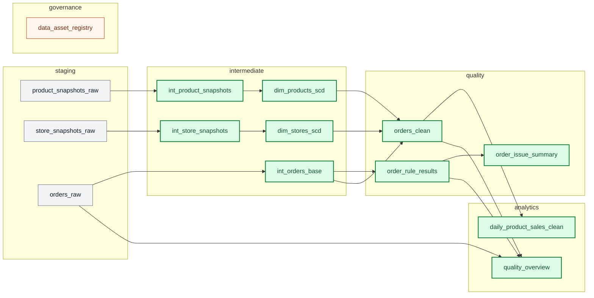

# Lisaülesanne: vii 6. praktikumi kvaliteediahel `dbt` alla

## Eesmärk

Selle lisaülesande eesmärk on näidata, kuidas sama 6. praktikumi töövoog muutub `dbt` abil paremini hallatavaks.

Põhirajal tegid sammud eraldi `psql` failidega.
Selles lisarajas jäävad toorandmed samaks, aga:

- dimensioonid muutuvad `dbt` mudeliteks;
- kvaliteedikontrollid muutuvad `dbt` mudeliteks ja testideks;
- analüütikakiht ehitatakse `dbt` abil;
- dokumentatsioon ja `source()` ning `ref()` seosed muutuvad nähtavaks `dbt docs` vaates.

See lisaülesanne ei asenda põhirada.
Ta aitab näha, kuidas olemasolevat `SQL`-põhist tööd saab edasi arendada tööriistaga, mida kasutatakse päris andmetiimides väga sageli.

## Õpiväljundid

Lisaülesande lõpuks oskad:

- käivitada eraldi `dbt` teenuse olemasoleva praktikumi keskkonna sees;
- selgitada, mis vahe on `source()` ja `ref()` viitel;
- ehitada `dbt` abil `intermediate`, `quality` ja `analytics` kihi tabelid;
- käivitada `dbt build` ja tõlgendada testide tulemust;
- genereerida `dbt docs` dokumentatsiooni ja vaadata sealt andmete pärinevust;
- kirjeldada, mida `OpenMetadata` annaks sellele lahendusele veel juurde.

## Hinnanguline ajakulu

Arvesta umbes 60 kuni 90 minutiga.

## Eeldused

See lisaülesanne eeldab, et oled:

- loonud `.env` faili;
- käivitanud praktikumi keskkonna;
- laadinud toorandmed `staging` kihti.

Kui tegid põhiraja juba läbi, siis on need eeldused täidetud.
Kui alustad puhtamast seisust, piisab selle lisaülesande jaoks kahest laadimissammust:

```bash
docker compose exec python python scripts/load_source_data.py refresh-dimensions
docker compose exec python python scripts/load_source_data.py load-orders
```

Need kaks käsku jätavad andmed `staging` kihti.
Sealt edasi võtab töö üle `dbt`.

## Miks see lisaülesanne on oluline?

Põhirada õpetas, mida me tahame kontrollida ja miks see on oluline.
`dbt` aitab sama loogikat paremini korrastada.

Selle praktiline kasu on tavaliselt neljas kohas:

- mudelite sõltuvusjärjestus ei ole enam peas või eraldi tabelis meeles hoida, sest `ref()` loob selle automaatselt;
- testid on paremini hallatavad: osa reegleid elab mudelite juures, osa eraldi testifailides, aga nende käivitamiseks piisab ühest `dbt` käsust;
- mudelite kirjeldused elavad koos koodiga;
- `dbt docs` annab kohe vaate, kust andmed tulevad ja millest uus tabel kokku pannakse.

See ei ole veel andmekataloog.
Aga see on tugev samm sinna poole.

## Mida selles lisarajas teadlikult ei tee?

Selles lisaülesandes teeme mõned teadlikud piirid, et fookus püsiks selge.
Mõte ei ole näidata kõiki `dbt` võimalusi korraga.
Mõte on teha üks selge ja realistlik üleminek olemasolevast `SQL` töövoost `dbt` töövoo poole.

### Me ei vii kuiseid snapshot-faile `dbt seed` alla

Toodete ja poodide kuised `CSV` failid jäävad siin endiselt allikaandmeteks.
Laeme need edasi `staging` kihti olemasoleva laadimissammuga.

See on teadlik valik kahel põhjusel:

- need failid on sisuliselt lähteandmed, mitte arendustiimi enda hallatav väike abiloend;
- nii jääb nähtavaks realistlik tööjaotus: allikad laetakse sisse enne, `dbt` modelleerib edasi.

`dbt seed` sobib paremini siis, kui fail on:

- väike;
- aeglaselt muutuv;
- repositooriumi enda hallatav;
- pigem kooditabel või kaardistusloend kui päris lähteandmestik.

Näited, mis sobiksid sagedamini `seed` alla:

- riikide loend;
- staatusekoodide seletused;
- kategooriate käsitsi hallatav kaardistus.

### Me ei kasuta siin `dbt snapshot` funktsiooni

`dbt snapshot` oskab samuti `SCD Type 2` loogikat teha.
Selles lisaülesandes jätame SCD loogika tavaliseks mudeliks, et korraga muutuks ainult tööriist, mitte ka meetod.

See hoiab õppimise lihtsamana:

- põhiraja SCD mõte jääb samaks;
- muutub ainult see, kuidas me selle loogika töövoogu paigutame.

Kui tahad `dbt snapshot` teemat ise edasi uurida, vaata:

- [3. praktikumi edasijõudnute juhendit](../../03-andmete-integreerimine/edasijoudnud/README.md)

Seal on snapshot lähenemine juba otsesemalt kasutusel.

### Me ei vii andmevara registrit `dbt` alla

Selles lisarajas jääb andmevara register teadlikult välja.
`dbt` annab meile tehnilise dokumentatsiooni, testid ja andmepärinevuse (`lineage`) vaate.
Laiem andmehaldus, omanike haldamine, märgendid ja ärisõnastik sobivad juba järgmise sammuna paremini andmekataloogi tööriista kätte.

See ongi hea sild edasijõudnute `OpenMetadata` praktikumi juurde.

Kui tahad seda järgmist sammu ise edasi uurida, vaata:

- [6. praktikumi edasijõudnute juhendit](../../06-andmekvaliteet-ja-haldus/edasijoudnud/README.md)

## Praktikumi failid

Kõik allpool toodud suhtelised failiteed eeldavad, et asud kaustas `06-andmekvaliteet-ja-haldus/baastase`.

- [`Dockerfile.dbt`](./Dockerfile.dbt) ehitab eraldi `dbt` konteineri
- [`dbt_project/dbt_project.yml`](./dbt_project/dbt_project.yml) seadistab projekti mudelid, skeemid ja dokumentatsiooni
- [`dbt_project/profiles.yml`](./dbt_project/profiles.yml) kirjeldab ühenduse PostgreSQL-iga
- [`dbt_project/models/sources.yml`](./dbt_project/models/sources.yml) määrab ära `staging` allikad
- [`dbt_project/models/intermediate/`](./dbt_project/models/intermediate) sisaldab puhastavaid mudeleid ja `SCD Type 2` dimensioone
- [`dbt_project/models/quality/`](./dbt_project/models/quality) sisaldab kvaliteedireeglite tulemusi ja puhastatud tellimusi
- [`dbt_project/models/marts/`](./dbt_project/models/marts) sisaldab analüütikakihi koondeid
- [`dbt_project/tests/`](./dbt_project/tests) sisaldab äriloogika taseme teste, mida standardtestidega üksi mugavalt ei kata

## 1. Käivita või uuenda teenused

Kui tegid selle praktikumikausta muudatused endale esimest korda nähtavaks, ehita teenused uuesti:

```bash
docker compose up -d --build
```

Kontrolli, et ka `dbt` teenus töötaks:

```bash
docker compose ps
```

Oodatav tulemus:

- `praktikum-db-06-base`
- `praktikum-python-06-base`
- `praktikum-source-api-06-base`
- `praktikum-dbt-06-base`

on olekus `running` või `Up`.

## 2. Valmista `staging` allikad ette

Kui põhirada on juba läbi tehtud, võid selle sammu vahele jätta.

Kui vajad värsket lähteolukorda, käivita:

```bash
docker compose exec python python scripts/load_source_data.py refresh-dimensions
docker compose exec python python scripts/load_source_data.py load-orders
```

Esimene käsk laeb kuised toodete ja poodide snapshotid `staging` kihti.
Teine käsk toob tellimused kohalikust `API`-st `staging.orders_raw` tabelisse.

Kontrolli soovi korral tulemust:

```bash
docker compose exec python psql -c "SELECT COUNT(*) FROM staging.product_snapshots_raw;"
docker compose exec python psql -c "SELECT COUNT(*) FROM staging.store_snapshots_raw;"
docker compose exec python psql -c "SELECT COUNT(*) FROM staging.orders_raw;"
```

## 3. Kontrolli `dbt` ühendust

Enne mudelite käivitamist kontrolli, et `dbt` näeb andmebaasi.

```bash
docker compose exec dbt dbt debug
```

Oodatav tulemus on rida, kus näed mõtet `All checks passed`.

Kui ühendus töötab, siis on `dbt` projekti profiil ja andmebaasi ühendus korras.

## 4. Vaata üle, millele `dbt` toetub

Enne ehitamist tasub korraks näha, kust `dbt` oma pildi kokku paneb.

Ava `VS Code`-is fail [`dbt_project/models/sources.yml`](./dbt_project/models/sources.yml).

Vaata sealt:

- millised `staging` tabelid on kirjeldatud allikatena;
- millised väljad on juba testidega kaetud;
- kuidas `dbt` eristab lähteandmeid (`source`) mudelitest, mida ta ise ehitab.

Vaata, millised mudelid projektis olemas on:

```bash
docker compose exec dbt dbt ls --resource-type model
```

See käsk ei ehita veel midagi.
Ta näitab lihtsalt, millised mudelid projektis olemas on.
Siin ei näe sa veel `staging` tabeleid, sest need on selles projektis kirjeldatud allikatena ehk `source`-idena, mitte `dbt` mudelitena.

Pane tähele kihte:

- `intermediate` valmistab andmed ette;
- `quality` kogub reeglirikkumised ja puhastatud read;
- `analytics` annab lõpliku koondvaate.

## 5. Ehita mudelid ja käivita testid

Nüüd käivita kogu lisaülesande `dbt` rada ühe käsuga:

```bash
docker compose exec dbt dbt build
```

See käsk teeb järjest kolm asja:

- ehitab mudelid;
- käivitab standardsed `dbt` testid, mis on kirjas `schema.yml` failides;
- käivitab eraldi `SQL` testid kaustast `tests/`.

Selles projektis on testid jagatud kaheks:

- lihtsamad väljade ja seoste kontrollid elavad mudelite juures `schema.yml` failides;
- keerukamad reeglid, nagu kehtivusvahemike kattumise kontroll, elavad kaustas `tests/`.

See tööjaotus on päriselus üsna tavaline.

## 6. Vaata, millised tabelid `dbt` ehitas

Pärast `dbt build` käsku saad kontrollida, et `dbt` kirjutas tulemused samadesse skeemidesse, mida põhirajal juba kasutasid.

Proovi näiteks:

```bash
docker compose exec python psql -c "SELECT * FROM intermediate.dim_products_scd WHERE product_id = 'P-100' ORDER BY valid_from;"
docker compose exec python psql -c "SELECT rule_name, failed_rows FROM quality.order_issue_summary ORDER BY failed_rows DESC, rule_name;"
docker compose exec python psql -c "SELECT sales_date, store_name, product_name, total_quantity, gross_sales_eur FROM analytics.daily_product_sales_clean ORDER BY sales_date, store_name, product_name LIMIT 10;"
```

Siin on oluline tähelepanek:

- `dbt` ei nõudnud, et skeemid oleksid ümber nimetatud;
- `dbt` ei nõudnud, et peaksid allikad `seed` alla viima;
- `dbt` võttis üle just selle osa, kus `SQL` mudelite sõltuvused, testid ja dokumentatsioon hakkavad kõige rohkem väärtust andma.

## 7. Genereeri dokumentatsioon ja vaata andmepärinevust

`dbt` üks suur tugevus on see, et mudelite dokumentatsioon ja sõltuvused saab kiiresti nähtavaks teha.

Genereeri dokumentatsioonifailid:

```bash
docker compose exec dbt dbt docs generate
```

Seejärel käivita dokumentatsiooni server:

```bash
docker compose exec dbt dbt docs serve --host 0.0.0.0 --port 8080
```

Ava brauseris:

- `http://localhost:18086` ehk vaikimisi hostiport

Kui muutsid `.env` failis väärtust `DBT_DOCS_PORT_HOST`, kasuta brauseris seda porti.

Võid märgata, et `dbt` ise kirjutab terminali:

```text
Serving docs at 8080
To access from your browser, navigate to: http://localhost:8080
```

See viitab konteineri sisesele pordile `8080`.
Brauseris pead aga avama hosti pordi, mille `docker compose` seob selle konteineri pordiga.
Selles praktikumis on vaikimisi seos `18086:8080`, seega avad brauseris aadressi `http://localhost:18086`.

Kui töötad GitHub Codespacesis, ava `VS Code` alumisest ribast või külgpaneelist vaade `Ports`, otsi sealt port `18086` ja ava selle juures brauserilink.

Mida tasub vaadata:

- `sources` all näed `staging` tabeleid;
- `int_product_snapshots`, `int_store_snapshots` ja `int_orders_base` näitavad, kuidas `source()` toorandmeid sisse toob;
- `dim_products_scd` ja `dim_stores_scd` näitavad, kuidas `ref()` loob järgmise taseme sõltuvused;
- `orders_clean` ja `daily_product_sales_clean` näitavad, kuidas kvaliteedi- ja analüütikakiht sõltuvad eelmistest sammudest.

Just siin muutub lineage õppijale nähtavaks ilma, et peaks kogu sõltuvusjärjestust peas hoidma.

## 8. Võrdle seda põhirajaga

Põhirajal jooksid sammud eraldi käskudena:

- laadimine;
- dimensioonide ehitamine;
- kvaliteedikontroll;
- mart-kihi ehitamine;
- metaandmete lisamine.

Selles lisarajas jääb oluline mõte samaks, aga juhtimise viis muutub:

- allikad tulevad endiselt `staging` kihti väljaspool `dbt`-d;
- `dbt` teab nüüd ise, millises järjekorras mudelid ehitada;
- testid käivad mudelitega samas projektis;
- dokumentatsioon ei ole enam eraldi märkmikus, vaid koodiga seotud.

See on realistlik üleminek käsitsi juhitud `SQL` töövoost `dbt`-põhise töökorralduse poole.

### Joonis: millised tabelid on nüüd `dbt` hallata?

Alloleval joonisel:

- hallid kastid on olemasolevad `source` tabelid, mida `dbt` loeb;
- rohelised kastid on tabelid või vaated, mida selles lisarajas haldab `dbt`;
- oranž kast on tabel, mille jätame selles lisarajas teadlikult `dbt`-st välja.

Kõige kindlam on seda joonist vaadata esmalt GitHubi veebilehel, kus Mermaid plokid peaksid avanema otse joonisena.
Kui tahad näha sama joonist ka `VS Code` eelvaates, võid soovi korral paigaldada lisa `Markdown Preview Mermaid Support`.
Arvesta siiski, et GitHubi ja `VS Code` eelvaate välimus võib veidi erineda.



## 9. Kuidas see viib edasi `OpenMetadata` juurde?

Pärast seda lisaülesannet on sul juba olemas kolm väga olulist asja:

- kirjeldatud allikad;
- mudelite sõltuvused;
- testid ja mudelite dokumentatsioon.

Edasijõudnute 6. praktikum näitab, kuidas `OpenMetadata` sellele veel juurde annab:

- tsentraalse otsitava andmekataloogi;
- omanike ja andmehaldurite (`steward`) halduse;
- märgendid ja sõnastiku;
- ühe vaate üle mitme tööriista, mitte ainult `dbt` projekti sees.

Hea mõtteharjutus on see:

`dbt docs` vastab hästi küsimusele "kuidas see mudel ehitati?".

`OpenMetadata` aitab vastata ka küsimustele:

- kes selle eest vastutab;
- kus seda kasutada tohib;
- millised andmekogud on omavahel seotud üle terve platvormi;
- millised kvaliteedikontrollid ja metaandmed on olemas ühes kesksemas vaates.

## Levinud vead ja lahendused

### `dbt debug` ütleb, et profiili ei leitud

Tõenäoline põhjus:

- `dbt` konteiner ei kasuta projekti sees olevat `profiles.yml` faili;
- teenus ei ole pärast `compose.yml` muudatust uuesti ehitatud.

Lahendus:

- kontrolli, et teenuses `dbt` on keskkonnamuutuja `DBT_PROFILES_DIR=/dbt`;
- käivita uuesti `docker compose up -d --build`.

### `dbt debug` näitab rida `git [ERROR]`

Tõenäoline põhjus:

- `dbt` konteineris puudub süsteemne `git` käsk.

See viga võib olla segadust tekitav, sest `dbt` paigaldatakse `pip` abil.
`git` ei ole aga Pythoni teek, vaid operatsioonisüsteemi käsk.
Seepärast ei tule ta ainult `pip install dbt-postgres` sammuga automaatselt kaasa.

Lahendus:

- uuenda `Dockerfile.dbt` faili nii, et konteiner paigaldaks ka paketi `git`;
- pärast seda käivita `docker compose up -d --build` uuesti;
- siis proovi käsku `docker compose exec dbt dbt debug` uuesti.

### `dbt build` ütleb, et source tabelit ei leitud

Tõenäoline põhjus:

- `staging` kihis ei ole lähteandmeid veel olemas.

Lahendus:

- käivita enne `refresh-dimensions` ja `load-orders`;
- kontrolli `psql` abil, et tabelites `staging.product_snapshots_raw`, `staging.store_snapshots_raw` ja `staging.orders_raw` oleks read olemas.

### `dbt docs serve` töötab, aga brauseris ei avane midagi

Tõenäoline põhjus:

- dokumentatsiooni server jookseb konteineris, aga port ei ole veel avatud õigele hosti aadressile;
- GitHub Codespacesis ei ole porti veel edasi suunatud.

Lahendus:

- kontrolli, et `compose.yml` failis oleks `DBT_DOCS_PORT_HOST` seotud konteineri pordiga `8080`;
- kui töötad Codespacesis, ava see hostiport Ports vaates.

## Kokkuvõte

Selles lisaülesandes nägid, et 6. praktikumi olemasolev töövoog on juba väga `dbt`-sobiv.

Sa ei pidanud:

- skeeme ümber nimetama;
- kogu praktikumi nullist ümber kirjutama;
- toorandmete laadimist kohe keerulisemaks muutma.

Piisas sellest, et võtsid olemasolevad `staging` allikad ja tõid transformatsiooni, testid ning dokumentatsiooni `dbt` projekti alla.

See ongi selle lisaülesande kõige olulisem mõte:
`dbt` ei pea algama uuest süsteemist.
Sageli saab teda võtta kasutusele samm-sammult juba olemasoleva `SQL` töövoo peal.
