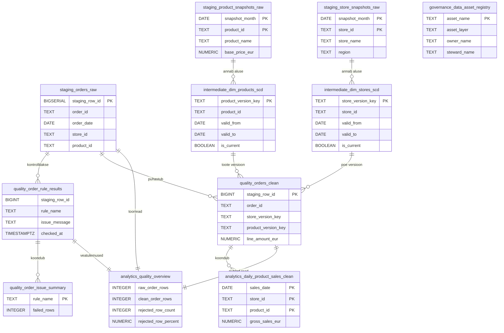

# Praktikum 6: Andmekvaliteet ja andmehaldus (baastase)

## Sisukord

- [Praktikumi eesmärk](#praktikumi-eesmärk)
- [Õpiväljundid](#õpiväljundid)
- [Hinnanguline ajakulu](#hinnanguline-ajakulu)
- [Eeldused](#eeldused)
- [Enne alustamist](#enne-alustamist)
- [Praktikumi failid](#praktikumi-failid)
- [Kus praktikumi failid asuvad?](#kus-praktikumi-failid-asuvad)
- [Miks see teema on oluline?](#miks-see-teema-on-oluline)
- [Miks kasutame siin kuiseid snapshot-faile ja SCD Type 2 välju?](#miks-kasutame-siin-kuiseid-snapshot-faile-ja-scd-type-2-välju)
- [Uued mõisted](#uued-mõisted)
- [Soovitatud töötee](#soovitatud-töötee)
- [Käsusild 4. Praktikumi Skriptiga](#käsusild-4-praktikumi-skriptiga)
- [1. Ava õige kaust](#1-ava-õige-kaust)
- [2. Loo `.env` fail](#2-loo-env-fail)
- [3. Käivita teenused](#3-käivita-teenused)
- [4. Kontrolli, et teenused töötavad](#4-kontrolli-et-teenused-töötavad)
- [5. Vaata üle allikad](#5-vaata-üle-allikad)
- [6. Värskenda kuised snapshotid ja ehita SCD-dimensioonid](#6-värskenda-kuised-snapshotid-ja-ehita-scd-dimensioonid)
- [7. Lae tellimused kohalikust API-st staging-kihti](#7-lae-tellimused-kohalikust-api-st-staging-kihti)
- [8. Vaata üle ehitatud SCD-dimensioonid](#8-vaata-üle-ehitatud-scd-dimensioonid)
- [9. Käivita andmekvaliteedi kontrollid](#9-käivita-andmekvaliteedi-kontrollid)
- [10. Ehita puhas müügikoond](#10-ehita-puhas-müügikoond)
- [11. Lisa metaandmed ja lihtne andmevara register](#11-lisa-metaandmed-ja-lihtne-andmevara-register)
- [12. Kontrolli tulemusi ühe koondpäringute failiga](#12-kontrolli-tulemusi-ühe-koondpäringute-failiga)
- [Kontrollpunktid](#kontrollpunktid)
- [Levinud vead ja lahendused](#levinud-vead-ja-lahendused)
- [Kokkuvõte](#kokkuvõte)
- [Loodud andmebaasi ER-diagramm](#loodud-andmebaasi-er-diagramm)
- [Valikulised lisaharjutused](#valikulised-lisaharjutused)
- [Koristamine](#koristamine)

## Praktikumi eesmärk

Selle praktikumi eesmärk on teha läbi väike, aga päriselt kasutatav andmekvaliteedi töövoog.

Me kasutame kahte tüüpi allikaid:

- kuiseid `CSV` snapshot-faile toodete ja poodide kohta;
- kohalikku `HTTP API`-t, mis annab tellimuste toorread.

Praktikumi lõpuks teed läbi kogu väikese kvaliteediahela:

- laed toorandmed `staging` kihti;
- ehitad kuistest snapshotitest `SCD Type 2` dimensioonid;
- käivitad kvaliteedireeglid;
- eraldad vigased read puhastest ridadest;
- ehitad puhastatud müügikoondi;
- lisad andmevaradele lihtsad metaandmed.

Selles praktikumis ei kasuta me veel eraldi andmekataloogi tööriista nagu OpenMetadata.
Selle asemel teeme kõige olulisemad sammud läbipaistvalt PostgreSQL-is.
Nii on lihtsam näha, mida andmekvaliteet ja andmehaldus päriselt tähendavad.

Kogu selle kursuse jooksul ei ehita me ettevõtte terviklahendust ega tegele tehingusüsteemi poole haldamisega.
Tehinguline pool ehk `OLTP` on meil siin esindatud ainult andmeallikana.
Meie põhirõhk on analüütilisel rajal ehk `OLAP` poolel.
See tähendab, et harjutame eelkõige `ETL`-i töövõtteid: andmete laadimist, kontrollimist, puhastamist, kirjeldamist ja analüüsiks ettevalmistamist.

Oluline piir on ka andmehalduse vaatest.
Samasugused põhimõtted kehtivad tavaliselt ka `OLTP` süsteemides.
Ka seal on vaja teada, kust andmed tulevad, mida väljad tähendavad, kes vastutab andmete eest ja millised kvaliteedireeglid peavad kehtima.
Selles praktikumis me seda poolt eraldi ei kata.

## Õpiväljundid

Praktikumi lõpuks oskad:

- käivitada väikese andmekvaliteedi praktikumi keskkonna `docker compose` abil;
- laadida kuised `CSV` snapshotid ja API tellimused `staging` kihti;
- selgitada, miks kasutatakse dimensioonides kehtivusvahemikke;
- käivitada vähemalt viis kvaliteedireeglit ja näidata, millised read läbi kukuvad;
- eristada toorandmeid, vigaseid ridu ja puhast väljundit;
- kirjeldada, mis väärtus on tabeli kirjeldusel, omaniku infol ja andmevara registril.

## Hinnanguline ajakulu

Arvesta umbes 2 kuni 2,5 tunniga.

See aeg jaguneb ligikaudu nii:

- 20 min keskkonna ja failidega tutvumiseks;
- 20 min allikate laadimiseks;
- 20 min `SCD Type 2` dimensioonide ehitamiseks ja vaatamiseks;
- 30 min kvaliteedikontrollide käivitamiseks ja tulemuste uurimiseks;
- 20 min puhta müügikoondi ehitamiseks;
- 15 min metaandmete ja andmevara registri osaks;
- 15 kuni 25 min kokkuvõtteks ja lisaharjutuseks.

## Eeldused

Sul on vaja:

- `VS Code`-i või GitHub Codespacesit;
- terminali;
- töötavat Dockeri keskkonda;
- selle repositooriumi faile.

Kasuks tuleb, kui eelmiste baastaseme praktikute põhjal on juba tuttavad järgmised töövõtted:

- oskad avada õige praktikumi kausta;
- oskad luua `.env` faili `.env.example` põhjal;
- oskad käivitada käsu `docker compose up -d`;
- oskad käivitada `psql` käske kujul `docker compose exec python psql ...`;
- tead, et osa käske käib hosti terminalis ja osa käske täidetakse konteineri sees.

Kui mõni neist sammudest on veel ebakindel, vaata vajadusel üle:

- [Praktikum 1: PostgreSQL-iga ühenduse loomine ja esimese CSV-faili laadimine](../../01-andmeinseneeria-alused/baastase/README.md)
- [Praktikum 3: Andmete integreerimine API ja CSV abil](../../03-andmete-integreerimine/baastase/README.md)
- [Praktikum 4: Andmetorude orkestreerimine kohaliku `cron`-töövooga](../../04-andmetorude-orkestreerimine/baastase/README.md)

## Enne alustamist

### Soovitatud keskkond

Selle praktikumi jaoks sobib hästi järgmine tööviis:

- ava kaust `06-andmekvaliteet-ja-haldus/baastase` `VS Code`-is;
- kasuta `VS Code`-i sisseehitatud terminali;
- hoia ühes aknas lahti `README.md`, teises `compose.yml`, kolmandas `scripts/load_source_data.py`;
- käivita käsud hosti terminalist, kui juhendis ei ole öeldud teisiti.

Selles juhendis on käsud valitud nii, et need töötavad samal kujul:

- macOS-is ja Linuxis;
- Git Bashis;
- Windows PowerShellis;
- GitHub Codespacesi terminalis.

See tähendab, et me väldime siin teadlikult shellimuutujaid nagu `$MUUTUJA` või `$env:MUUTUJA`.
Nii on põhivoog eri keskkondades võimalikult ühtlane.

Kui töötad GitHub Codespacesis, siis on praktikumi kaust tavaliselt siin:

```text
/workspaces/ut-andmeinseneeria-2026/06-andmekvaliteet-ja-haldus/baastase
```

### Puhas algus

See praktikum kasutab järgmisi hosti porte:

- andmebaas `5436`;
- kohalik allika-`API` `8016`.

Kui need pordid on mõne muu teenuse poolt hõivatud, peata konfliktne teenus enne praktikumi alustamist.

Kui oled seda praktikumi juba varem käivitanud ja tahad täiesti puhast algust, kasuta juhendi lõpus käsku:

```bash
docker compose down -v
```

See eemaldab ka andmebaasi mahuühenduse.
Järgmisel käivitamisel luuakse toortabelid uuesti.

## Praktikumi failid

Kõik allpool toodud suhtelised failiteed eeldavad, et asud kaustas `06-andmekvaliteet-ja-haldus/baastase`.

- [`compose.yml`](./compose.yml) kirjeldab andmebaasi, kohaliku API ja Pythoni konteinerit
- [`.env.example`](./.env.example) sisaldab praktikumi vaikimisi keskkonnamuutujaid
- [`Dockerfile.python`](./Dockerfile.python) ehitab Pythoni konteineri, kus on nii `Python` kui ka `psql` klient
- [`Dockerfile.dbt`](./Dockerfile.dbt) ehitab valikulise `dbt` konteineri lisaülesande jaoks
- [`init/01_create_raw_objects.sql`](./init/01_create_raw_objects.sql) loob `staging`, `intermediate`, `quality`, `analytics` ja `governance` skeemid ning toortabelid
- [`source_api/server.py`](./source_api/server.py) käivitab kohaliku tellimuste `API`
- [`source_data/products_2026_03.csv`](./source_data/products_2026_03.csv) on märtsi tootesnapshot
- [`source_data/products_2026_04.csv`](./source_data/products_2026_04.csv) on aprilli tootesnapshot
- [`source_data/stores_2026_03.csv`](./source_data/stores_2026_03.csv) on märtsi poodide snapshot
- [`source_data/stores_2026_04.csv`](./source_data/stores_2026_04.csv) on aprilli poodide snapshot
- [`scripts/load_source_data.py`](./scripts/load_source_data.py) on praktikumi väike orkestreerija, mis juhib etappe käsupõhiselt
- [`scripts/00_load_dimension_snapshots.sql`](./scripts/00_load_dimension_snapshots.sql) laeb kuised snapshot-failid `staging` kihti käsuga `\copy`
- [`scripts/01_build_dimensions.sql`](./scripts/01_build_dimensions.sql) ehitab `SCD Type 2` dimensioonid
- [`scripts/02_run_quality_checks.sql`](./scripts/02_run_quality_checks.sql) käivitab kvaliteedireeglid ja loob vigaste ridade tabelid
- [`scripts/03_build_clean_mart.sql`](./scripts/03_build_clean_mart.sql) ehitab puhastatud müügikoondi
- [`scripts/04_add_metadata.sql`](./scripts/04_add_metadata.sql) lisab tabelikirjeldused ja andmevara registri kirjed
- [`scripts/05_check_results.sql`](./scripts/05_check_results.sql) koondab kontrollpäringud
- [`scripts/99_reset.sql`](./scripts/99_reset.sql) puhastab praktikumi tabelid ilma Docker mahtu kustutamata
- [`dbt_project/`](./dbt_project) sisaldab valikulise `dbt` lisaülesande valmis projekti
- [`LISAULESANNE_DBT.md`](./LISAULESANNE_DBT.md) juhendab, kuidas sama praktikumi kvaliteediahel viia `dbt` alla

## Kus praktikumi failid asuvad?

Selles praktikumis on korraga kasutusel neli konteksti:

- host ehk sinu arvuti või Codespace;
- andmebaasi konteiner `db`;
- Pythoni konteiner `python`;
- kohaliku allika teenus `source-api`.

Sama fail võib eri kontekstides olla eri teega.

Näited:

- hostis on fail `scripts/01_build_dimensions.sql`;
- Pythoni konteineris on sama fail `/app/scripts/01_build_dimensions.sql`;
- hostis on fail `source_data/products_2026_04.csv`;
- Pythoni konteineris on sama fail `/app/source_data/products_2026_04.csv`;
- andmebaasi konteineris neid faile ei ole.

See vahe on oluline kolmel põhjusel:

- selles praktikumis avame `psql` kliendi Pythoni konteineris, mitte andmebaasi konteineris;
- `docker compose exec python psql -f scripts/01_build_dimensions.sql` loeb faili Pythoni konteineri vaatest;
- `\copy ... FROM 'source_data/...'` loeb failid samuti Pythoni konteineri vaatest, sest `\copy` on `psql` kliendi käsk.

Oluline vahe:

- `\copy` loeb faili kliendi ehk Pythoni konteineri seest;
- `COPY ... FROM '/tee/fail.csv'` prooviks faili lugeda andmebaasiserveri seest.

Selles praktikumis on õige valik `\copy`, sest `source_data` failid on olemas ainult Pythoni konteineris.

See lahendus on tahtlikult sarnane 4. praktikumi tööviisiga.
Ka seal jooksid käsud rakenduse konteineris, mis ühendus andmebaasiga üle võrgu.

Kohalik API on omakorda nähtav kahel eri aadressil:

- hostist ehk brauserist: `http://localhost:8016`
- Pythoni konteinerist: `http://source-api:8016`

## Miks see teema on oluline?

Päris tööelus ei piisa sellest, et andmed lihtsalt “jõuavad kohale”.

Vaja on vastata ka järgmistele küsimustele:

- kas mõni oluline väli puudub;
- kas sama sündmus tuli topelt;
- kas toote või poe tunnus on üldse olemas;
- kas hind on mõistlik;
- kas tabelist saab teine inimene aru ka ilma suulise selgituseta.

Andmekvaliteet tähendab siin seda, et meil on kokku lepitud kontrollid.
Need kontrollid aitavad vigaseid ridu leida enne, kui neist tehakse raport või näidikulaud (`dashboard`).

Andmehaldus tähendab siin seda, et lisaks andmetele kirjeldame ka andmeid endid.
Ütleme välja, mis tabel see on, kes selle eest vastutab, kui tihti see uueneb ja milleks seda kasutada tohib.

## Miks kasutame siin kuiseid snapshot-faile ja SCD Type 2 välju?

Probleem on lihtne.
Toote nimi, hind või poe nimetus võib ajas muutuda.

Kui me hoiaksime alles ainult “praegust” seisu, siis võiks vana tellimus saada vale kirjelduse.
Näiteks märtsi tellimus võiks paista aprilli tootenimega.

Selle vältimiseks kasutame siin lihtsat `SCD Type 2` lähenemist.
See tähendab, et sama toote või poe kohta võib olla mitu versiooni.
Igal versioonil on oma kehtivusvahemik:

- `valid_from` ütleb, millal versioon hakkab kehtima;
- `valid_to` ütleb, millal versioon lõpeb;
- `is_current` näitab, kas see on viimane ehk praegu kehtiv versioon.

Selles praktikumis ei ehita sa seda loogikat nullist ise.
Sa kasutad valmis `SQL`-skripti ja vaatad läbi, mida see teeb ja miks see kvaliteedi seisukohalt oluline on.

## Uued mõisted

### Andmekvaliteet

Andmekvaliteet lahendab probleemi, kus andmed on küll olemas, aga neid ei saa usaldada.

Lihtsas keeles tähendab see, et andmed vastavad kokku lepitud ootustele.

Näide:

Kui tellimusel puudub `store_id` või kogus on `0`, siis on andmerida kahtlane ja vajab kontrolli.

### Kvaliteedireegel

Kvaliteedireegel on üks konkreetne kontroll.

Näide:

Reegel võib öelda, et `quantity` peab olema nullist suurem või et `product_id` peab leiduma vastava perioodi tootesnapshotis.

### Snapshot

Snapshot lahendab probleemi, kus allikas muutub ajas ja vana seisu on hiljem vaja taastada.

Lihtsas keeles on snapshot ühe hetke või perioodi seisukoopia.

Selles praktikumis on märtsi ja aprilli kohta eraldi `CSV` failid.
Need näitavad, milline oli toodete ja poodide seis selle kuu alguses.

### `SCD Type 2`

`SCD Type 2` lahendab probleemi, kus ühe dimensiooni väärtused muutuvad ajas, aga vana seis peab alles jääma.

Lihtsas keeles tähendab see, et me ei kirjuta vana rida üle.
Me lisame uue versiooni ja paneme mõlemale versioonile kehtivuskuupäevad.

Näide:

Kui `P-100` nimi muutub märtsist aprilli, siis jääb alles nii märtsi versioon kui ka aprilli versioon.

### Vigane rida

Vigane rida on rida, mis rikub vähemalt üht kvaliteedireeglit.

Selles praktikumis võivad vigased read olla näiteks:

- duplikaatse tellimuse ID-ga read;
- puuduva poe ID-ga read;
- tundmatu toote ID-ga read;
- ebaloogilise hinnaga read.

### Metaandmed

Metaandmed lahendavad probleemi, kus tabel on olemas, aga keegi ei tea, mis see tähendab.

Lihtsas keeles on metaandmed andmete kohta käivad andmed.

Näide:

Tabeli kirjeldus, omanik, uuendamise sagedus ja lühike kasutusotstarve on metaandmed.

### Andmevara register

Andmevara register on lihtne koht, kuhu paneme kirja kõige olulisemad andmeobjektid ja nende põhikirjelduse.

Selles praktikumis kasutame selleks tavalist PostgreSQL tabelit.
Edasijõudnute rajal näed, kuidas sama mõte viiakse üle eraldi andmekataloogi tööriista.

## Soovitatud töötee

Soovitatud töötee on järgmine:

1. käivita keskkond;
2. vaata üle allikad;
3. värskenda kuised snapshotid ja ehita dimensioonid;
4. lae tellimused kohalikust `API`-st `staging` kihti;
5. käivita kvaliteedikontrollid;
6. ehita puhastatud müügikoond;
7. lisa metaandmed ja andmevara registri kirjed;
8. kontrolli tulemused üle.

See järjekord aitab sul näha andmete liikumist kihiti:

- `staging`
- `intermediate`
- `quality`
- `analytics`
- `governance`

## Käsusild 4. Praktikumi Skriptiga

Kui 4. praktikum on veel meeles, siis on selle nädala Pythoni skript teadlikult tuttava kujuga.
Võrdle omavahel faile [`scripts/orchestrate.py`](../../04-andmetorude-orkestreerimine/baastase/scripts/orchestrate.py) ja [`scripts/load_source_data.py`](./scripts/load_source_data.py).

Seal kasutasid sa käske:

- `refresh-dimensions`
- `run-once`
- `run-scheduled`
- `backfill`

Siin kasutad sa käske:

- `refresh-dimensions`
- `load-orders`
- `run-quality`
- `build-mart`
- `add-metadata`
- `run-all`

Lühike võrdlus:

| Praktikum 4 | Praktikum 6 | Põhjus |
|-------------|-------------|--------|
| `refresh-dimensions` | `refresh-dimensions` | Mõte on sama. Valmistame ette kirjeldavad tabelid, millele järgmised sammud toetuvad. |
| `run-once --logical-date ...` | `load-orders --from-date ... --to-date ...` | Praktikum 4 töötles ühte päeva kui töövooüksust. Praktikum 6 toob kvaliteedikontrolli jaoks sisse väikese kuupäevavahemiku. |
| `backfill` | `run-all --from-date ... --to-date ...` | Mõlemas liigume ajaloolise vahemiku peale, aga 6. praktikumis ei õpeta me ajastamist, vaid kvaliteediahela etappe. |
| `run-scheduled` | otsest vastet ei ole | Seekordne fookus ei ole scheduler ega `cron`, vaid vigaste ridade leidmine, puhas väljund ja metaandmed. |

Oluline sarnasus jääb alles:

- mõlemal nädalal on üks keskne Pythoni skript;
- mõlemal nädalal on mitu käsuga käivitatavat sammu;
- mõlemal nädalal saab õppija käivitada kas kogu töövoo korraga või ainult need etapid, mida on vaja uuesti teha.

Selline jaotus aitab sul töövoogu sammhaaval jälgida ja vajaduse korral uuesti käivitada ainult selle osa, mida parasjagu vajad.
Kui tahad hiljem nende praktikute ideid omavahel siduda, siis saad võtta 4. praktikumi töövoo ja täiendada seda 6. praktikumi kvaliteedisammudega.
Näiteks võiksid tulevikus lisada 4. praktikumi torusse siit pärit käsud `run-quality` või `add-metadata`.

## 1. Ava õige kaust

Ava kaust `06-andmekvaliteet-ja-haldus/baastase`.

Kui alustad repo juurkaustast, kasuta terminalis:

```bash
cd 06-andmekvaliteet-ja-haldus/baastase
```

## 2. Loo `.env` fail

See samm tehakse hosti terminalis.

Kopeeri näidisfailist päris keskkonnamuutujate fail:

```bash
cp .env.example .env
```

Mida see teeb?

See loob faili `.env`, mida `docker compose` kasutab portide ja ühenduseandmete jaoks.

Oluline tähelepanek:

- kui sul oli see praktikum juba varem käivitatud, siis võib kaustas juba olla vana `.env` fail;
- `.env.example` muudatused ei jõua olemasolevasse `.env` faili automaatselt;
- kui tahad kasutada juhendi praeguseid vaikeväärtusi, kontrolli üle read `SOURCE_START_DATE` ja `SOURCE_END_DATE`.

Õnnestumise märk:

- kausta ilmub uus fail `.env`.

## 3. Käivita teenused

See samm tehakse hosti terminalis.

Käivita praktikumi teenused:

```bash
docker compose up -d --build
```

Mida see teeb?

- käivitab andmebaasi konteineri `db`;
- käivitab kohaliku tellimusallika `source-api`;
- ehitab Pythoni konteineri `python`, kust laeme andmeid sisse.

Esimene käivitus võib võtta veidi kauem aega, sest Pythoni konteinerisse paigaldatakse vajalikud teegid.

## 4. Kontrolli, et teenused töötavad

See samm tehakse hosti terminalis.

Kontrolli teenuste olekut:

```bash
docker compose ps
```

Oodatav tulemus:

- `praktikum-db-06-base` on olekus `running` või `Up`;
- `praktikum-source-api-06-base` on olekus `running` või `Up`;
- `praktikum-python-06-base` on olekus `running` või `Up`.

Kui andmebaas on valmis, saad soovi korral kontrollida ka ühendust:

```bash
docker compose exec python psql -c "SELECT current_database(), current_user;"
```

Selles käsus ei pea eraldi lisama `-U`, `-h` ega `-d` lippe.
Põhjus on see, et Pythoni konteiner saab `.env` failist juba ette muutujad `PGHOST`, `PGUSER`, `PGPASSWORD` ja `PGDATABASE`.

Oodatav tulemus:

- andmebaasi nimi on `praktikum`;
- kasutaja on `praktikum`.

## 5. Vaata üle allikad

Selles sammus vaatad korraks üle, milliste allikatega me töötame.

### Snapshot-failid

Vaata `source_data` kaustas olevaid faile:

- `products_2026_03.csv`
- `products_2026_04.csv`
- `stores_2026_03.csv`
- `stores_2026_04.csv`

Oluline tähelepanek:

- aprilli snapshotis on muutunud mõned nimed;
- aprilli snapshotis on lisandunud uus toode `P-500`;
- aprilli snapshotis on lisandunud uus pood `S-PNU`.

See ongi põhjus, miks hiljem vajame kehtivusvahemikke.

### Kohalik API

Ava brauseris:

```text
http://localhost:8016/docs
```

Sealt näed brauseris loetavat lühidokumentatsiooni, nagu 4. praktikumis.

Oluline erinevus on siiski olemas.
6. praktikumis on kohalik allikas teadlikult lihtsam kui 4. nädalal.
Siin ei harjuta me `retry` loogikat, ajastatud käivitusi ega poolelioleva äripäeva käsitlemist.
Siin on põhirõhk sellel, et kvaliteedikontrollidel oleksid realistlikud, aga hästi kontrollitavad näidisvead.

Soovi korral ava ka üks päris näide:

```text
http://localhost:8016/orders?date=2026-04-02
```

Kui tahad võrrelda 4. praktikumi teega, siis töötab ka alias:

```text
http://localhost:8016/api/orders?date=2026-04-02
```

Mida sellest sammust tähele panna?

- sama kuupäev annab alati sama vastuse;
- vastus on sorteeritud välja `source_updated_at` järgi ehk kronoloogilises järjekorras;
- me ei sõltu välisest interneti-API-st;
- praktikumi sees on mõned teadlikult lisatud vead, et kvaliteedikontrollidel oleks midagi leida;
- docs-leht näitab nüüd ka lühidalt, millised vead on milliste kuupäevade juurde pandud.

## 6. Värskenda kuised snapshotid ja ehita SCD-dimensioonid

See samm tehakse hosti terminalis.

Käivita praktikumi orkestreerija esimese etapiga:

```bash
docker compose exec python python scripts/load_source_data.py refresh-dimensions
```

Mida see teeb?

- käivitab faili `scripts/00_load_dimension_snapshots.sql`;
- loeb mõlemad toote `CSV` failid käsuga `\copy`;
- loeb mõlemad poodide `CSV` failid käsuga `\copy`;
- kirjutab need tabelitesse `staging.product_snapshots_raw` ja `staging.store_snapshots_raw`;
- ehitab seejärel `SCD Type 2` dimensioonid.

Siin tasub korraks vaadata faili [`scripts/00_load_dimension_snapshots.sql`](./scripts/00_load_dimension_snapshots.sql).
Seal näed üht olulist tehnilist valikut: kasutame `\copy` käsku, mitte `COPY` käsku.
Põhjus on lihtne: failid on olemas Pythoni konteineris, mitte andmebaasi konteineris.

Miks on see 4. praktikumi mõttes tuttav samm?

Nagu sealne `refresh-dimensions`, valmistab ka see käsk ette kirjeldavad andmed, millele järgmised sammud toetuvad.

Kontrolli tulemust:

```bash
docker compose exec python psql -c "SELECT COUNT(*) AS product_snapshot_rows FROM staging.product_snapshots_raw;"
docker compose exec python psql -c "SELECT COUNT(*) AS store_snapshot_rows FROM staging.store_snapshots_raw;"
```

Oodatav tulemus:

- toodete snapshoti ridu on `9`;
- poodide snapshoti ridu on `7`.

Pane tähele, et sama samm lõi juba ka tabelid `intermediate.dim_products_scd` ja `intermediate.dim_stores_scd`.
Vaatame need loodud dimensioonitabelid üle 8. sammus.

## 7. Lae tellimused kohalikust API-st staging-kihti

See samm tehakse hosti terminalis.

Lae praktikumi jaoks üheksapäevane vahemik:

```bash
docker compose exec python python scripts/load_source_data.py load-orders --from-date 2026-03-29 --to-date 2026-04-06
```

Seda vahemikku võid soovi korral ka muuta.
Tegelik toetatud kuupäevavahemik tuleb sinu praegu kasutuses olevast `.env` failist.
Kui lõid `.env` faili selle juhendi praeguse `.env.example` põhjal, siis lubab kohalik allikas kuupäevi `2026-03-01` kuni `2026-04-30`.
Kui valid sellest väljapoole jääva päeva, lõpetab skript töö selge veateatega ja näitab toetatud vahemiku ette.
Kui tahad allika vahemikku ise nihutada, muuda `.env` failis väärtusi `SOURCE_START_DATE` ja `SOURCE_END_DATE` ning käivita seejärel `docker compose up -d --build` uuesti.
Kui sul on kaustas vanem `.env` fail, siis võib töötav vahemik olla endiselt näiteks `2026-03-25` kuni `2026-04-06`.
Pane tähele, et juhendi järgmistes sammudes toodud oodatud ridade arvud ja protsendid eeldavad siiski siin kasutatud vaikevahemikku `2026-03-29` kuni `2026-04-06`.

Mida see teeb?

- küsib kohaliku `API` käest iga päeva tellimused;
- kirjutab need tabelisse `staging.orders_raw`;
- tühjendab enne `staging.orders_raw` tabeli ja laeb selle uuesti ainult valitud vahemiku ridadest.

Nii annab sama käsk sama sisendiga uuesti käivitades sama tulemuse.
Teisisõnu on see samm praktikumi mõttes idempotentne.

Kontrolli tulemust:

```bash
docker compose exec python psql -c "SELECT COUNT(*) AS order_rows FROM staging.orders_raw;"
```

Oodatav tulemus:

- tellimuse ridu on `127`.

Kui tahad näha, kuidas read päevade peale jaotuvad, käivita:

```bash
docker compose exec python psql -c "SELECT order_date, COUNT(*) AS order_rows FROM staging.orders_raw GROUP BY order_date ORDER BY order_date;"
```

Õnnestumise märk:

- kuupäevad jooksevad vahemikus `2026-03-29` kuni `2026-04-06`.

## 8. Vaata üle ehitatud SCD-dimensioonid

See samm tehakse hosti terminalis, aga `psql` jookseb Pythoni konteineris.

Pythoni skript ehitas dimensioonid juba eelmises sammus.
Nüüd vaatame üle, kas tulemus sai õige ja kuidas üks muutunud kirje ajas versioonideks jaguneb.

Kontrolli tulemust:

```bash
docker compose exec python psql -c "SELECT COUNT(*) AS product_versions FROM intermediate.dim_products_scd;"
docker compose exec python psql -c "SELECT COUNT(*) AS store_versions FROM intermediate.dim_stores_scd;"
```

Oodatav tulemus:

- tooteversioone on `9`;
- poeversioone on `7`.

Vaata ühte muutunud toodet lähemalt:

```bash
docker compose exec python psql -c "SELECT * FROM intermediate.dim_products_scd WHERE product_id = 'P-100' ORDER BY valid_from;"
```

Mida väljundist otsida?

- `P-100` kohta peaksid nägema kahte versiooni;
- märtsi versioon lõpeb `2026-03-31`;
- aprilli versioon algab `2026-04-01`.

## 9. Käivita andmekvaliteedi kontrollid

See samm tehakse hosti terminalis.

Käivita kvaliteedikontrollid:

```bash
docker compose exec python python scripts/load_source_data.py run-quality
```

Mida see teeb?

- käivitab faili `scripts/02_run_quality_checks.sql`;
- loob tabeli `quality.order_rule_results`, kus iga vigane rida saab reegli nime;
- loob koondtabeli `quality.order_issue_summary`;
- loob tabeli `quality.orders_clean`, kuhu jäävad ainult kvaliteedikontrolli läbinud read.

Selles praktikumis kontrollime vähemalt järgmisi asju:

- tellimuse ID ei tohi puududa;
- tellimuse ID ei tohi olla duplikaat;
- poe ID ei tohi puududa;
- toote ID ei tohi puududa;
- kogus peab olema nullist suurem;
- tellimuse kuupäeva jaoks peab leiduma sobiv poe versioon;
- tellimuse kuupäeva jaoks peab leiduma sobiv toote versioon;
- ühikuhind peab jääma mõistlikku vahemikku.

Kontrolli kokkuvõtet:

```bash
docker compose exec python psql -c "SELECT rule_name, failed_rows FROM quality.order_issue_summary ORDER BY failed_rows DESC, rule_name;"
```

Oodatav tulemus:

- `order_id_duplicate` annab `2` rida;
- `product_must_exist_for_order_date` annab `1` rea;
- `quantity_must_be_positive` annab `1` rea;
- `store_id_missing` annab `1` rea;
- `unit_price_close_to_snapshot` annab `1` rea.

Vaata, mitu rida jäi puhtaks:

```bash
docker compose exec python psql -c "SELECT COUNT(*) AS clean_rows FROM quality.orders_clean;"
```

Oodatav tulemus:

- puhtaid ridu on `121`.

## 10. Ehita puhas müügikoond

See samm tehakse hosti terminalis.

Käivita puhastatud müügikoondi skript:

```bash
docker compose exec python python scripts/load_source_data.py build-mart
```

Mida see teeb?

- ehitab tabeli `analytics.daily_product_sales_clean`;
- arvutab kokku päevase müügikoondi ainult puhaste ridade pealt;
- loob ka tabeli `analytics.quality_overview`, kus on lühike kvaliteedi kokkuvõte.

Kontrolli kvaliteedi ülevaadet:

```bash
docker compose exec python psql -c "SELECT raw_order_rows, clean_order_rows, rejected_row_count, total_rule_failures, rejected_row_percent FROM analytics.quality_overview;"
```

Oodatav tulemus:

- `raw_order_rows` on `127`;
- `clean_order_rows` on `121`;
- `rejected_row_count` on `6`;
- `total_rule_failures` on `6`;
- `rejected_row_percent` on umbes `4.72`.

Vaata üht osa puhastatud koondist:

```bash
docker compose exec python psql -c "SELECT sales_date, store_name, product_name, total_quantity, gross_sales_eur FROM analytics.daily_product_sales_clean ORDER BY sales_date, store_name, product_name LIMIT 12;"
```

Õnnestumise märk:

- näed ainult puhastatud ridu;
- märtsi ja aprilli read kasutavad õige perioodi poe- ja tootenimesid.

## 11. Lisa metaandmed ja lihtne andmevara register

See samm tehakse hosti terminalis.

Käivita metaandmete skript:

```bash
docker compose exec python python scripts/load_source_data.py add-metadata
```

Mida see teeb?

- lisab tabelitele ja veergudele kirjeldused `COMMENT ON` käskudega;
- täidab tabeli `governance.data_asset_registry`;
- paneb kirja omaniku, halduri, värskendussageduse ja lühikese kasutuse selgituse.

Kontrolli andmevara registrit:

```bash
docker compose exec python psql -c "SELECT asset_name, owner_name, refresh_frequency, source_system FROM governance.data_asset_registry ORDER BY asset_name;"
```

Oodatav tulemus:

- registris on vähemalt viis andmevara kirjet;
- nende hulgas on `staging.orders_raw`, `quality.order_rule_results` ja `analytics.daily_product_sales_clean`.

Miks see samm oluline on?

Sama tabel võib tehniliselt töötada ka ilma kirjelduse ja omanikuta.
Aga siis on järgmisel inimesel raske aru saada:

- milleks tabel on loodud;
- kas see sobib raporti allikaks;
- kui tihti see uueneb;
- kelle poole küsimustega pöörduda.

## 12. Kontrolli tulemusi ühe koondpäringute failiga

See samm tehakse hosti terminalis, aga `psql` jookseb Pythoni konteineris.

Käivita koondpäringute fail:

```bash
docker compose exec python psql -f scripts/05_check_results.sql
```

Kui väljund avaneb lehekülgede kaupa, siis saad liikuda nooleklahvidega või tühikuklahviga.
Väljumiseks vajuta klahvi `q`.

Mida see teeb?

See fail koondab kokku kõige olulisemad kontrollpäringud:

- snapshoti ridade arvud;
- päevade kaupa tellimuste arvud;
- `SCD` dimensioonide sisu;
- kvaliteedireeglite kokkuvõtte;
- vigaste ridade näited;
- puhastatud müügikoondi näited;
- andmevara registri sisu;
- tabelikirjeldused.

See on hea fail, mille juurde hiljem tagasi tulla, kui tahad kogu töö korra uuesti üle vaadata.

## Kontrollpunktid

Kui oled praktikumi põhiraja läbi teinud, siis peaks sul olema järgmine seis:

- teenused `db`, `source-api` ja `python` töötavad;
- `staging.product_snapshots_raw` sisaldab `9` rida;
- `staging.store_snapshots_raw` sisaldab `7` rida;
- `staging.orders_raw` sisaldab `127` rida;
- `intermediate.dim_products_scd` ja `intermediate.dim_stores_scd` on loodud;
- `quality.order_issue_summary` näitab viit veatüüpi, millest üks on duplikaatne tellimuse ID;
- `quality.orders_clean` sisaldab `121` rida;
- `analytics.daily_product_sales_clean` on loodud;
- `governance.data_asset_registry` sisaldab vähemalt viit kirjet.

Kui tahad sama voo ühe käsuga uuesti läbi teha, võid kasutada ka:

```bash
docker compose exec python python scripts/load_source_data.py run-all --from-date 2026-03-29 --to-date 2026-04-06
```

See ei asenda põhiraja samm-sammulist õppimist, aga on hea kordamiseks ja katsetamiseks.

Praktikumi põhirada on ehitatud nii, et samu samme võib sama sisendiga uuesti käivitada.
Kui muudad aga midagi ühes etapis, siis käivita uuesti ka kõik sellest allavoolu jäävad etapid.
Näiteks kui jooksutad uuesti `refresh-dimensions` või `load-orders`, siis on kõige kindlam jätkata sealt edasi uuesti käskudega `run-quality`, `build-mart` ja vajadusel `add-metadata`.
Kui tahad kogu ahela värske tulemuse ühe korraga uuesti kätte saada, kasuta selleks käsku `run-all`.

## Levinud vead ja lahendused

### Sümptom: `docker compose exec ...` käsud ütlevad, et teenust ei leitud

Tõenäoline põhjus:

- sa ei asu õiges kaustas;
- `docker compose up -d --build` jäi enne pooleli.

Lahendus:

- kontrolli, et asud kaustas `06-andmekvaliteet-ja-haldus/baastase`;
- käivita uuesti `docker compose ps`;
- vajadusel käivita `docker compose up -d --build` uuesti.

### Sümptom: `refresh-dimensions` ütleb, et faili ei leitud

Tõenäoline põhjus:

- `source_data` kaust ei ole konteinerisse õigesti mountitud;
- käivitasid käsu vales praktikumi kaustas.

Lahendus:

- kontrolli faili olemasolu hostis kaustas `source_data/`;
- kontrolli `compose.yml` failist, et `./source_data:/app/source_data` maht oleks olemas;
- käivita käsk uuesti õigest kaustast.

### Sümptom: tellimuste laadimisel tuleb ühenduse viga API-ga

Tõenäoline põhjus:

- `source-api` konteiner ei tööta veel;
- API tervisekontroll ei ole veel valmis.

Lahendus:

- kontrolli `docker compose ps`, et `source-api` oleks olekus `Up`;
- ava brauseris `http://localhost:8016/health`;
- kui vastus ei tule, oota mõni sekund ja proovi uuesti.

### Sümptom: `load-orders` ütleb, et valitud kuupäev ei mahu toetatud vahemikku

Tõenäoline põhjus:

- valisid käsus `--from-date` või `--to-date` kuupäeva, mida kohalik allikas praegu ei paku;
- `.env` failis on allika kuupäevavahemik kitsam kui sinu proovitud päring.

Lahendus:

- ava brauseris `http://localhost:8016/health` või `http://localhost:8016/docs` ja vaata üle, milline vahemik on praegu lubatud;
- kasuta sellest vahemikust kuupäevi;
- kui tahad vahemikku laiendada, muuda `.env` failis väärtusi `SOURCE_START_DATE` ja `SOURCE_END_DATE`;
- pärast muudatust käivita `docker compose up -d --build` uuesti.

### Sümptom: kvaliteedikontrollide tulemus ei klapi juhendi oodatud arvudega

Tõenäoline põhjus:

- tellimused on laaditud mõne teise kuupäevavahemiku jaoks;
- kvaliteediskript jooksis enne, kui `SCD` dimensioonid olid loodud;
- eelmise katse andmed jäid tabelitesse alles.

Lahendus:

- kontrolli, et laadisid tellimused vahemikust `2026-03-29` kuni `2026-04-06`;
- käivita kõigepealt `refresh-dimensions`, alles siis `run-quality`;
- vajadusel käivita `docker compose exec python psql -f scripts/99_reset.sql`, lae andmed uuesti ja alusta kontrollidest otsast.

### Sümptom: `psql -f scripts/...` ütleb, et faili ei leitud

Tõenäoline põhjus:

- käsk jookseb vales konteineris;
- failitee ei ole Pythoni konteineri vaatest õige.

Lahendus:

- kontrolli, et kasutad käsku `docker compose exec python ...`;
- eelista siin suhtelisi teid kujul `scripts/01_build_dimensions.sql`;
- ära kasuta selle praktikumi põhirajal `COPY FROM '/tee/fail.csv'`, sest andmefailid ei ole andmebaasi konteineris.

## Kokkuvõte

Selles praktikumis tegid läbi väikese, aga tööelule väga lähedase andmekvaliteedi töövoo.

Sa nägid, et kvaliteedikontroll ei ole ainult üks `NOT NULL` tingimus.
See on terve mõtteviis:

- lae toorandmed sisse;
- säilita ajaline kontekst;
- kontrolli reegleid;
- eralda vigased read;
- ehita puhas väljund;
- lisa kirjeldused ja vastutuse info.

Sama loogika on ka suuremates tööriistades.
Edasijõudnute rajal näed, kuidas OpenMetadata aitab neid samu mõtteid tsentraalselt hallata.
Baastasemes oli oluline kõigepealt aru saada, mida me üldse tahame kontrollida ja kirjeldada.

## Loodud andmebaasi ER-diagramm

Praktikumi lõpuks on andmebaasis olemas järgmine loogiline skeem.

See joonis näitab peamisi seoseid tabelite vahel.
Mõni neist seostest on andmebaasis päris võtme kaudu, mõni on loogiline seos, mida kasutame `JOIN`-ides ja kvaliteedireeglites.

Pane tähele ka seda, et tabel `governance.data_asset_registry` on skeemis olemas, kuid ta ei ole teiste tabelitega seotud välisvõtmete kaudu.
Ta hoiab andmevarade kirjeldusi tekstiväljade kaudu.

Kõige kindlam on seda joonist vaadata esmalt GitHubi veebilehel, kus Mermaid plokid peaksid avanema otse joonisena.
Kui tahad näha sama joonist ka `VS Code` eelvaates, võid soovi korral paigaldada lisa `Markdown Preview Mermaid Support`.
Arvesta siiski, et GitHubi ja `VS Code` eelvaate välimus võib veidi erineda.



## Valikulised lisaharjutused

Lisaharjutused on iseseisvaks katsetamiseks ja mõtlemiseks. Neid ei pea praktikumi jooksul ära tegema.

Vali üks lisaharjutus või proovi mitut.

1. Lisa uus kvaliteedireegel.

See on selle praktikumi jaoks hea jätkuharjutus, sest ta pikendab otse sammu `run-quality`.

Kui tegid praktikumi läbi juhendi vaikevahemikuga, võid näiteks lisada reegli, et `order_date` ei tohi jääda väljapoole vahemikku `2026-03-29` kuni `2026-04-06`.
Võid valida ka mõne muu loogilise kontrolli, näiteks et `source_updated_at` kuupäev peab kattuma väljaga `order_date`.

Tee nii:

- kirjuta reegel faili `scripts/02_run_quality_checks.sql` uue `UNION ALL` blokina;
- käivita uuesti `run-quality`;
- käivita pärast seda uuesti ka `build-mart`, sest kvaliteedisammust allavoolu jääv tulemus võib muutuda;
- kontrolli tulemust käsuga `docker compose exec python psql -f scripts/05_check_results.sql`.

Mõtle juurde:

- kas see reegel kontrollib andmete kvaliteeti või pigem laadimisprotsessi;
- kas selle rikkumine peaks rea kohe tagasi lükkama või piisaks hoiatusest.

2. Täienda metaandmeid ja andmevara registrit.

Praegu lisame metaandmeid ainult osale tabelitest.
Täienda faili `scripts/04_add_metadata.sql` nii, et kirjeldus tekiks ka tabelitele `quality.order_issue_summary` ja `analytics.quality_overview`.
Soovi korral lisa need ka tabelisse `governance.data_asset_registry`.

Kui tahad, et uus info oleks kontrollisammus kohe näha, täienda ka faili `scripts/05_check_results.sql`.

Tee nii:

- lisa uued `COMMENT ON TABLE` või `COMMENT ON COLUMN` read;
- lisa registrisse vähemalt üks uus andmevara kirje;
- käivita uuesti `add-metadata`;
- lõpuks käivita uuesti `docker compose exec python psql -f scripts/05_check_results.sql`.

Mõtle juurde:

- milline info peab andmekataloogis või registris olemas olema juba esimesest päevast;
- milline info võib lisanduda hiljem, kui tööprotsess küpseb.

3. Kaardista ühe oma tööandmestiku kvaliteeditee.

Vali üks andmestik, aruanne või fail, millega sa oma töös päriselt kokku puutud.
Kirjuta endale lühidalt üles:

- kust need andmed tulevad;
- milliseid kvaliteedikontrolle praegu tehakse;
- kus need kontrollid elavad: lähteallikas, `ETL`, andmeladu, raport või käsitsi tehtud kontroll;
- kes saab veast teada ja mida ta seejärel teeb.

Lõpuks hinda, milline üks kontroll annaks teie töövoos kõige rohkem väärtust, aga puudub veel.

4. Hinda oma töö andmekataloogi või metaandmete seisu.

Vali üks tabel, fail või raport, mida sinu asutuses kasutatakse.
Proovi vastata järgmistele küsimustele:

- kas sa leiad kiiresti omaniku ja halduri;
- kas sa leiad lihtsas keeles kirjelduse, mida andmed tähendavad;
- kas sa näed, kui tihti andmed uuenevad;
- kas sa näed, milliseid kvaliteediootusi nende kohta teatakse;
- kas uus töötaja saaks neist andmetest aru ka ilma suulise selgituseta.

Kui mõni vastus on `ei`, siis mõtle, kas probleemi lahendaks parem dokumentatsioon, lihtne register või päris andmekataloog.

5. Proovi sama praktikumi `dbt` rajaga.

Kui tahad näha, kuidas sama kvaliteediahel muutub `dbt` abil paremini hallatavaks, ava eraldi juhend:

- [Lisaülesanne: vii 6. praktikumi kvaliteediahel `dbt` alla](./LISAULESANNE_DBT.md)

Selles lisarajas:

- kasutad samu `staging` allikaid, mis põhirajal;
- ehitad dimensioonid, kvaliteeditabelid ja analüütikakihi `dbt` mudelitena;
- käivitad kvaliteeditestid `dbt test` ja `dbt build` abil;
- genereerid `dbt docs` vaate, kust on näha `source()` ja `ref()` seosed;
- saad sujuva silla edasijõudnute `OpenMetadata` praktikumi juurde.

## Koristamine

Kui tahad praktikumi keskkonna peatada, kasuta:

```bash
docker compose down
```

Kui tahad peatada teenused ja eemaldada ka andmebaasi mahu, kasuta:

```bash
docker compose down -v
```

Kui tahad andmebaasi mahu alles jätta, aga praktikumi tabelid tühjendada, kasuta:

```bash
docker compose exec python psql -f scripts/99_reset.sql
```
